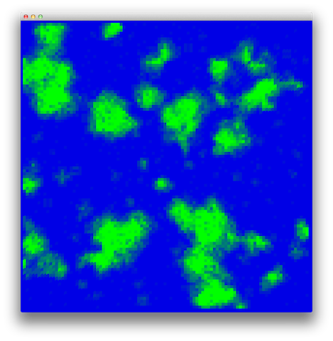
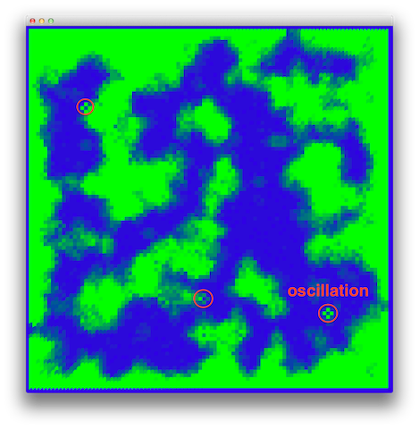
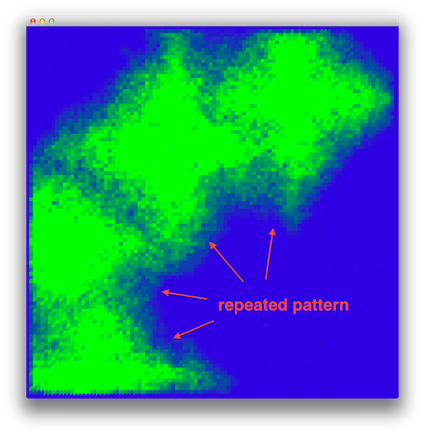
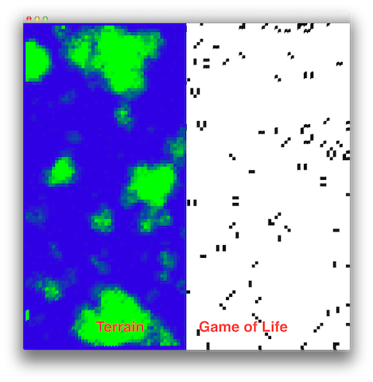
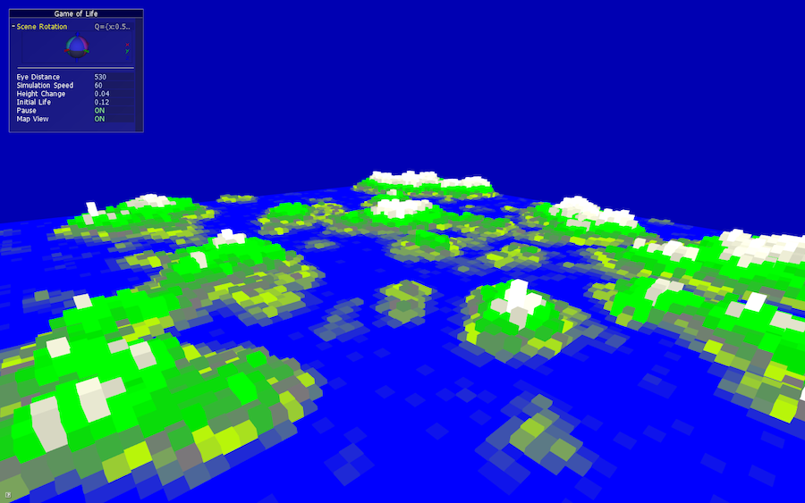
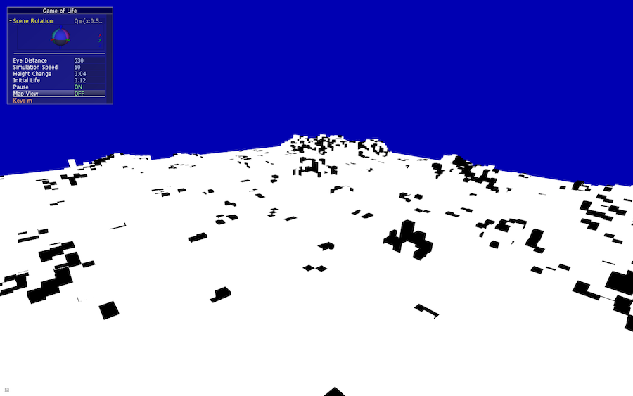

# cellular-automata-mapgen
Tile based map generator that works by visualizing the birth and death of cells. 
Started out as Conway’s Game of Life, but rules with fewer oscillators work better, 
because oscillations can create recognizable artifacts. Different automata create different types of maps.

